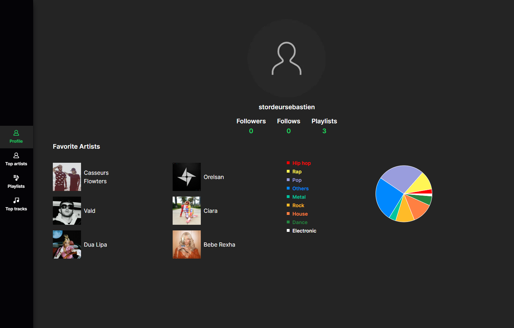

# Spotify Data Project

This project utilizes the Spotify API to retrieve information about the user's favorite songs and artists. It provides features to fetch user profile data, top tracks, top artists, and playlists.

## Prerequisites

Before running the project, make sure you have the following prerequisites:

- Node.js (v14 or above)
- npm (Node Package Manager) or yarn

## Getting Started

Follow the steps below to get the project up and running:

1. Clone the project repository.
2. Install the project dependencies by running `npm install` or `yarn install`.
3. Configure the Spotify API credentials by creating a `.env` file in the project root directory. Add the following variables:

- SPOTIFY_CLIENT_ID=your_spotify_client_id
- SPOTIFY_CLIENT_SECRET=your_spotify_client_secret

Replace `your_spotify_client_id` and `your_spotify_client_secret` with your actual Spotify API credentials.

4. Start the development server by running `npm run dev` or `yarn dev`.
5. Open your web browser and access the application at `http://localhost:3000`.

## Features

The Spotify Data Project includes the following features:

- User authentication using Spotify
- Displaying user profile information
- Fetching and displaying top tracks
- Fetching and displaying top artists
- Fetching and displaying playlists

## Technologies Used

The project is built using the following technologies:

- Next.js
- Spotify API
- Tailwind CSS
- Recharts

## License

This project is licensed under the MIT License. See the [LICENSE](LICENSE) file for more information.
